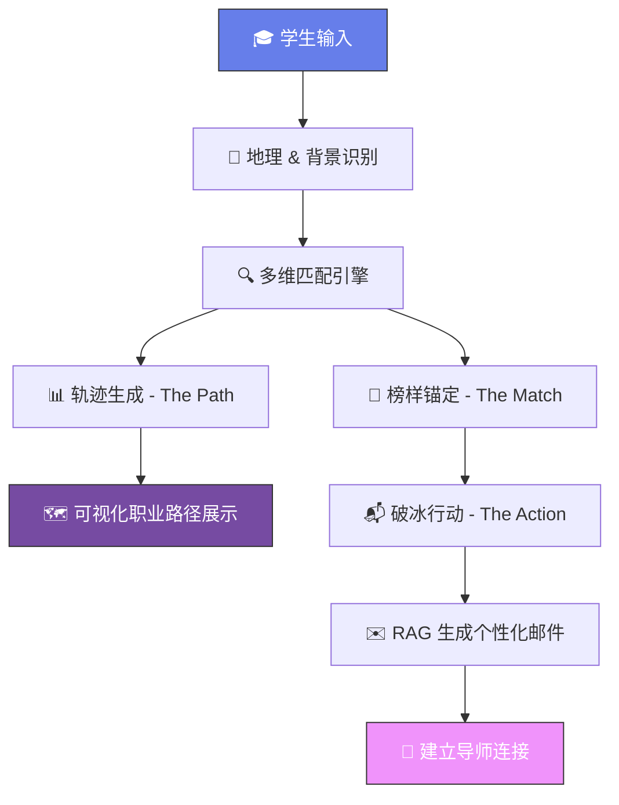
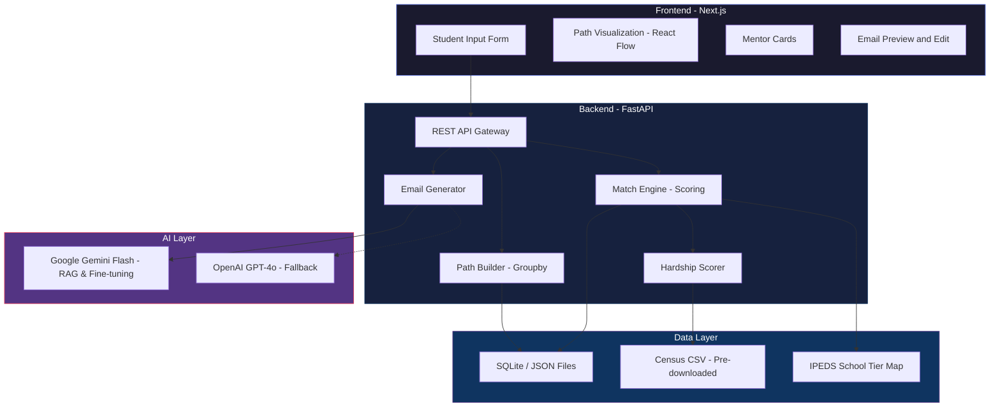

# 🚀 EchoPath — 项目技术文档

> **"Every path was once walked by someone before you."**
>
> EchoPath 是一款面向教育资源薄弱地区学生的职业导航与社交破冰平台。通过真实职业履历大数据分析，为学生展示"和自己起点相似的前辈"的成功轨迹，并借助 RAG 智能体生成高质量破冰邮件，帮助学生建立真实的导师连接。

---

## 目录

1. [产品概览与用户旅程](#1-产品概览与用户旅程)
2. [系统架构总览](#2-系统架构总览)
3. [技术栈与工具清单](#3-技术栈与工具清单)
4. [数据集需求](#4-数据集需求)
5. [核心模块详细设计](#5-核心模块详细设计)
6. [API 端点设计](#6-api-端点设计)
7. [实施路线图](#7-实施路线图)
8. [优化方向与扩展策略](#8-优化方向与扩展策略)
9. [Hackathon 演示策略](#9-hackathon-演示策略)

---

## 1. 产品概览与用户旅程

### 1.1 核心问题

来自教育资源薄弱地区的学生面临三大障碍：
- **信息差**：不知道"和自己起点类似的人"怎么走到成功的位置
- **人脉差**：缺乏连接行业前辈的渠道和信心
- **行动差**：即使找到目标人选，也不知道如何开口破冰

### 1.2 用户旅程流程



### 1.3 用户输入字段

> ⚠️ **语言说明**：目标用户为美国学生，前端界面、输入选项、生成邮件等所有面向用户的内容**必须使用英文**。后端代码注释与内部文档可用中文。

| 字段 | 类型 | 示例 | 用途 |
|------|------|------|------|
| `zip_code` / `fips_code` | string | `"06073"` | 定位教育资源水平 |
| `current_education` | dropdown | `"Community College"` / `"High School"` | 起点锚定（结构化下拉菜单） |
| `target_function` | dropdown | `"Software Engineering"` / `"Marketing"` | 目标职能方向（从预定义列表选择） |
| `target_level` | dropdown | `"Manager"` / `"Senior Staff"` | 目标职业级别（从预定义列表选择） |
| `dream_description` | text (optional) | `"I want to work at a top tech company..."` | 仅用于邮件生成时的个性化素材，**不参与匹配逻辑** |
| `school_name` | string (optional) | `"Modesto Junior College"` | 精准匹配校友 |

---

## 2. 系统架构总览



---

## 3. 技术栈与工具清单

### 3.1 核心技术栈（Hackathon MVP 精简版）

| 层级 | 技术 | 理由 |
|------|------|------|
| **前端** | Next.js 14 (App Router) + TypeScript | SSR SEO 友好 + 强类型 |
| **样式** | Tailwind CSS + Framer Motion | 快速原型 + 动画效果 |
| **可视化** | React Flow | 职业路径节点图渲染（比 D3.js 开发速度快 3x） |
| **后端** | Python FastAPI | 高性能异步 + 原生 JSON 支持 |
| **数据库** | SQLite + JSON 文件 | MVP 够用，零配置，部署简单 |
| **缓存** | Python `functools.lru_cache` / `dict` | MVP 数据量 <10k，内存缓存足够 |
| **匹配算法** | scikit-learn + NumPy | 多维打分 + 加权求和，无需向量数据库 |
| **LLM & RAG** | **Gemini 1.5/3.0 Flash API** | 邮件生成引擎架构 (支持长上下文 RAG 与后期的 RAFT 微调) |
| **Fallback** | OpenAI GPT-4o / Claude 3.5 | 备用生成方案 |
| **部署** | Vercel (前端) + Railway / Render (后端) | 一键部署、Hackathon 友好 |

### 3.2 开发工具

| 工具 | 用途 |
|------|------|
| **Jupyter Notebook** | 数据探索 & 特征工程原型 |
| **Pandas / NumPy** | 数据清洗 & 特征提取 |
| **scikit-learn** | 相似度计算 |
| **Pydantic** | 数据模型校验 |
| **Pytest** | 后端单元测试 |

### 3.3 第三方 API

| API | 用途 | 免费额度 |
|------|------|----------|
| **U.S. Census API** | FIPS Code → 地区经济/教育指标 | 免费 |
| **NCES API** | 学校层级数据（Title I 等） | 免费 |
| **Gemini API** | RAG 生成与模型微调训练 (RAFT) | Google AI Studio 免费额度 / Vertex AI |
| **OpenAI API** | LLM 推理 Fallback | 按量付费 |
| **Google Geocoding** | 地理编码辅助 | 免费额度充足 |

---

## 4. 数据集需求

### 4.1 主数据集：职业履历数据（已有）

你们已有的数据集格式极为关键。以下是字段分析和利用策略：

#### 核心字段提取策略

```python
# 从原始 JSON 中提取的关键特征维度

PROFILE_FEATURES = {
    # === 地理/起点特征 ===
    "origin_fips":        "从 jobs[] 中时间最早的 location_details.fips_code 提取",
    "origin_msa":         "最早期工作的 MSA (都市统计区)",
    "origin_state":       "最早期工作的 region",

    # === 教育特征 ===
    "education_school":   "education[].school",
    "education_degree":   "education[].degree (学历层次)",
    "education_field":    "education[].field (专业方向)",

    # === 职业轨迹特征 ===
    "career_start_level": "jobs[] 按时间排序，第一个 job 的 level",
    "career_end_level":   "当前 position.level",
    "career_function":    "position.function (所属职能)",
    "total_tenure_months":"所有 job.duration 之和",
    "company_count":      "去重后的公司数量",
    "industry_path":      "按时间排列的 company.industry 序列",

    # === 成功指标 ===
    "current_company_size":  "position.company.employee_count",
    "current_company_type":  "position.company.type (Public/Private)",
    "level_progression":     "从第一份工作 level 到当前 level 的跃升幅度",
    "is_currently_employed": "employment_status == 'employed'",
}
```

#### 数据质量过滤规则

```python
def is_valid_for_model(profile: dict) -> bool:
    """只有通过质量验证的履历才纳入模型。"""
    checks = [
        # 1. 必须有至少一段有效工作经历
        len([j for j in profile["jobs"] if j["title"] is not None]) >= 1,

        # 2. 教育信息不能全空
        len(profile.get("education", [])) > 0,

        # 3. 当前在职 (确保是"成功案例"样本)
        profile.get("employment_status") == "employed",

        # 4. 职业 level 不能全为 null
        any(j.get("level") for j in profile["jobs"]),

        # 5. 至少有一个地理信息可用
        any(
            j.get("location_details", {}).get("fips_code")
            for j in profile["jobs"]
            if j.get("location_details")
        ),
    ]
    return all(checks)
```

### 4.2 补充数据集（需额外获取）

| 数据集 | 来源 | 用途 | 获取方式 |
|--------|------|------|----------|
| **FIPS → 经济指标** | U.S. Census Bureau ACS | 将 `fips_code` 映射为"教育资源薄弱程度"评分 | [Census API](https://api.census.gov) 免费 |
| **Title I 学校列表** | NCES (National Center for Education Statistics) | 标记来自低收入学区的学生/校友 | [NCES Data](https://nces.ed.gov/ccd/elsi/) 免费下载 |
| **Zip Code ↔ FIPS 映射表** | HUD USPS Crosswalk | 用户输入 Zip Code 转 FIPS | [HUD API](https://www.huduser.gov/portal/datasets/usps_crosswalk.html) |
| **大学排名/层级** | Carnegie Classification / IPEDS | 将 `education[].school` 映射为学校层级 (社区大学 / 州立 / 旗舰 / 常春藤) | IPEDS 免费下载 |
| **行业薪资中位数** | BLS OEWS | 辅助"成功"指标量化 | [BLS Data](https://www.bls.gov/oes/) 免费 |
| **职业标准分类** | O\*NET / SOC Codes | 将用户的模糊职业目标映射到标准分类 | [O\*NET API](https://services.onetcenter.org/) |

### 4.3 数据集规模建议

| 维度 | Hackathon MVP | 生产级别 |
|------|---------------|----------|
| 职业履历条数 | 5,000 ~ 10,000 | 100,000+ |
| 覆盖地区 (FIPS) | Top 50 教育薄弱区 | 全美 3,000+ 县 |
| 行业覆盖 | 科技 + 金融 + 咨询 | 全行业 |
| 教育层级覆盖 | 社区大学 → 大厂 | 高中 → 任意终点 |

---

## 5. 核心模块详细设计

### 5.1 模块一：多维打分匹配引擎 (Match Engine)

#### 核心算法思路

采用**多维独立打分 + 加权求和**的方式。每个维度独立计算 0-1 分数，再按权重加权求和得到总匹配分。这种方式比余弦相似度更直观、可解释性更强、调试更容易。

```python
from dataclasses import dataclass
from functools import lru_cache
from datetime import datetime

@dataclass
class MatchResult:
    """匹配结果。"""
    profile_id: str
    total_score: float          # 加权总分 (0-1)
    dimension_scores: dict      # 各维度分数明细
    profile_snapshot: dict      # 前辈关键信息摘要

class MatchEngine:
    """多维打分匹配引擎：找到和当前学生起点最相似的前辈。"""

    # 各维度权重 — 地理 + 教育权重最高（核心匹配维度）
    WEIGHTS = {
        "geo_score":        0.30,   # 地理位置匹配度
        "edu_tier_score":   0.25,   # 教育层级相似度
        "hardship_score":   0.20,   # 经济困难指数相似度
        "function_score":   0.15,   # 目标职能匹配度
        "state_score":      0.10,   # 同一州加分
    }

    def __init__(self, hardship_scorer, school_tier_db: dict):
        self.hardship_scorer = hardship_scorer
        self.school_tier_db = school_tier_db  # school_name → tier (1-5)

    def find_matches(self, student: dict, alumni_list: list,
                     top_k: int = 10) -> list[MatchResult]:
        """
        对每个前辈逐维度打分，返回 Top-K 最高分的前辈。
        student: 已结构化的学生输入（含 fips, target_function, target_level 等）
        alumni_list: 预处理后的前辈列表
        """
        results = []
        for alumni in alumni_list:
            scores = self._score_all_dimensions(student, alumni)
            total = sum(scores[k] * self.WEIGHTS[k] for k in self.WEIGHTS)
            results.append(MatchResult(
                profile_id=alumni["id"],
                total_score=total,
                dimension_scores=scores,
                profile_snapshot=self._build_snapshot(alumni),
            ))

        results.sort(key=lambda r: r.total_score, reverse=True)
        return results[:top_k]

    def _score_all_dimensions(self, student: dict, alumni: dict) -> dict:
        """计算所有维度的评分 (各维度均为 0-1)。"""
        alumni_origin = self._get_origin_info(alumni)

        return {
            "geo_score": self._geo_score(
                student["fips_code"], alumni_origin["fips_code"]
            ),
            "state_score": 1.0 if student.get("state") == alumni_origin.get("state") else 0.0,
            "edu_tier_score": self._edu_tier_score(
                student["current_education"], alumni.get("education", [])
            ),
            "hardship_score": self._hardship_similarity(
                student["hardship_score"], alumni_origin.get("hardship_score", 0.5)
            ),
            "function_score": self._function_score(
                student["target_function"], alumni.get("jobs", [])
            ),
        }

    def _geo_score(self, student_fips: str, alumni_fips: str) -> float:
        """地理匹配：同 FIPS=1.0, 同州不同县=0.5, 不同州=0.0"""
        if student_fips == alumni_fips:
            return 1.0
        if student_fips[:2] == alumni_fips[:2]:  # 同一州 (FIPS 前两位=州代码)
            return 0.5
        return 0.0

    def _edu_tier_score(self, student_edu: str, alumni_education: list) -> float:
        """教育层级相似度：层级差距越小分越高。"""
        student_tier = self._edu_to_tier(student_edu)
        alumni_earliest_tier = min(
            (self._school_to_tier(e.get("school", "")) for e in alumni_education),
            default=3
        )
        # 层级差距 0→1.0, 1→0.75, 2→0.5, 3→0.25, 4+→0.0
        diff = abs(student_tier - alumni_earliest_tier)
        return max(0.0, 1.0 - diff * 0.25)

    def _hardship_similarity(self, student_hs: float, alumni_hs: float) -> float:
        """困难度相似性：差值越小分越高。"""
        return max(0.0, 1.0 - abs(student_hs - alumni_hs))

    def _function_score(self, target_fn: str, alumni_jobs: list) -> float:
        """职能匹配：前辈的当前/最近职能是否与学生目标一致。"""
        if not alumni_jobs:
            return 0.0
        latest_fn = alumni_jobs[-1].get("function", "")
        return 1.0 if latest_fn == target_fn else 0.0

    def _get_origin_info(self, alumni: dict) -> dict:
        """获取前辈最早期的地理和背景信息。"""
        valid_jobs = [j for j in alumni.get("jobs", []) if j.get("title")]
        if not valid_jobs:
            return {"fips_code": "", "state": ""}
        earliest = sorted(valid_jobs, key=lambda j: self._parse_date(j.get("started_at", "")))[0]
        loc = earliest.get("location_details", {})
        return {
            "fips_code": loc.get("fips_code", ""),
            "state": loc.get("region", ""),
            "hardship_score": self.hardship_scorer.get_score(loc.get("fips_code", "")),
        }

    def _parse_date(self, date_str: str) -> datetime:
        """容错的日期解析：支持 '2015-06-01', '2015-06', '2015' 等格式。"""
        for fmt in ("%Y-%m-%d", "%Y-%m", "%Y"):
            try:
                return datetime.strptime(date_str[:len(fmt.replace('%', '0'))], fmt)
            except (ValueError, TypeError):
                continue
        return datetime(1900, 1, 1)

    def _edu_to_tier(self, edu_label: str) -> int:
        """将用户选择的教育标签转为层级数值。"""
        mapping = {
            "High School": 0, "Community College": 1,
            "State University": 2, "Flagship State University": 3,
            "Private University": 4, "Ivy League": 5,
        }
        return mapping.get(edu_label, 2)

    def _school_to_tier(self, school_name: str) -> int:
        """根据 IPEDS 数据库查找学校层级。"""
        return self.school_tier_db.get(school_name, 2)  # 默认 Tier 2

    def _build_snapshot(self, alumni: dict) -> dict:
        """构建前辈摘要信息（匿名化）。"""
        return {
            "current_title": alumni.get("position", {}).get("title"),
            "current_level": alumni.get("position", {}).get("level"),
            "industry": alumni.get("position", {}).get("company", {}).get("industry"),
            "company_size": alumni.get("position", {}).get("company", {}).get("employee_count"),
            "education_summary": [
                {"degree": e.get("degree"), "field": e.get("field")}
                for e in alumni.get("education", [])
            ],
        }
```

#### 学校层级分类逻辑

```python
# 通过 IPEDS Carnegie Classification 自动分类，以下为手动补充映射
SCHOOL_TIER_MAP = {
    # Tier 5: Ivy League / Top Private
    "Harvard": 5, "Stanford": 5, "MIT": 5, "Yale": 5, "Princeton": 5,
    # Tier 4: Top Public Flagship
    "UC Berkeley": 4, "UCLA": 4, "University of Michigan": 4,
    # Tier 3: Strong State University
    "UC San Diego": 3, "University of Washington": 3,
    # Tier 2: General State University
    "San Diego State University": 2, "Cal State": 2,
    # Tier 1: Community College
    "community college": 1,
    # Tier 0: High School (起点)
    "high school": 0,
}
```

### 5.2 模块二：轨迹构建器 (Path Builder) — 简化版

#### 设计思路

**放弃**复杂的序列聚类（Smith-Waterman / N-Gram），改用**4 阶段简化模型 + Pandas groupby**。将每条职业轨迹抽象为 4 个阶段节点：`Education → First Job → Mid Career → Current Position`，然后按 `(edu_tier, first_industry, current_level)` 分组，统计每组人数和平均耗时。

这种方案只需 ~50 行 Pandas 代码，MVP 中完全够用。

```python
import pandas as pd
from dataclasses import dataclass
from typing import List

@dataclass
class CareerNode:
    """轨迹中的单个节点。"""
    stage: str            # "education" / "first_job" / "mid_career" / "current"
    label: str            # "Community College" / "Tech Startup" / "FAANG Manager"
    typical_duration: int  # 平均停留月数
    count: int            # 有多少人经过这个节点

@dataclass
class CareerPath:
    """一条抽象的职业路径。"""
    nodes: List[CareerNode]
    total_people: int      # 经历此路径的总人数
    avg_years: float       # 平均总耗时（年）

class PathBuilder:
    """从匹配到的前辈群体中，提取最常见的职业路径（简化版 groupby）。"""

    LEVEL_ORDER = {
        "Intern": 0, "Staff": 1, "Senior Staff": 2,
        "Manager": 3, "Senior Manager": 4, "Director": 5,
        "VP": 6, "C-Suite": 7
    }

    def build_paths(self, matched_profiles: list,
                    target_function: str, top_n: int = 3) -> List[CareerPath]:
        """
        输入: 匹配到的前辈履历列表
        输出: Top-N 最常见的抽象路径
        """
        # Step 1: 每个 profile 提取 4 阶段指纹
        records = []
        for profile in matched_profiles:
            fp = self._extract_fingerprint(profile)
            if fp:
                records.append(fp)

        if not records:
            return []

        df = pd.DataFrame(records)

        # Step 2: 按 (edu_tier, first_industry, current_level) 分组
        grouped = df.groupby(["edu_tier", "first_industry", "current_level"])

        # Step 3: 每个分组统计人数和平均耗时，生成 CareerPath
        paths = []
        for (edu_tier, first_ind, curr_level), group in grouped:
            nodes = [
                CareerNode(
                    stage="education",
                    label=group["edu_label"].mode().iloc[0],
                    typical_duration=int(group["edu_duration"].mean()),
                    count=len(group),
                ),
                CareerNode(
                    stage="first_job",
                    label=f"{first_ind} ({group['first_level'].mode().iloc[0]})",
                    typical_duration=int(group["first_job_duration"].mean()),
                    count=len(group),
                ),
                CareerNode(
                    stage="mid_career",
                    label=group["mid_label"].mode().iloc[0] if "mid_label" in group else "Various",
                    typical_duration=int(group["mid_duration"].mean()),
                    count=len(group),
                ),
                CareerNode(
                    stage="current",
                    label=f"{curr_level} in {group['current_industry'].mode().iloc[0]}",
                    typical_duration=0,
                    count=len(group),
                ),
            ]
            paths.append(CareerPath(
                nodes=nodes,
                total_people=len(group),
                avg_years=round(group["total_months"].mean() / 12, 1),
            ))

        paths.sort(key=lambda p: p.total_people, reverse=True)
        return paths[:top_n]

    def _extract_fingerprint(self, profile: dict) -> dict | None:
        """将一个 profile 简化为 4 阶段指纹。"""
        education = profile.get("education", [])
        jobs = sorted(
            [j for j in profile.get("jobs", []) if j.get("title")],
            key=lambda j: j.get("started_at", "")
        )

        if not jobs or not education:
            return None

        first_job = jobs[0]
        current_job = jobs[-1]
        mid_jobs = jobs[1:-1] if len(jobs) > 2 else []

        return {
            "edu_tier": self._school_tier(education[0].get("school", "")),
            "edu_label": f"{education[0].get('degree', 'N/A')} @ {education[0].get('school', 'Unknown')}",
            "edu_duration": education[0].get("duration", 48),  # 默认 4 年
            "first_industry": first_job.get("company", {}).get("industry", "Unknown"),
            "first_level": first_job.get("level", "Staff"),
            "first_job_duration": first_job.get("duration", 24),
            "mid_label": mid_jobs[len(mid_jobs)//2].get("title", "Various") if mid_jobs else "Direct",
            "mid_duration": sum(j.get("duration", 0) for j in mid_jobs),
            "current_level": current_job.get("level", "Unknown"),
            "current_industry": current_job.get("company", {}).get("industry", "Unknown"),
            "total_months": sum(j.get("duration", 0) for j in jobs),
        }

    def _school_tier(self, school_name: str) -> str:
        """返回学校层级标签（用于 groupby key）。"""
        from engines.match_engine import SCHOOL_TIER_MAP
        tier = SCHOOL_TIER_MAP.get(school_name, 2)
        tier_labels = {0: "High School", 1: "Community College", 2: "State Univ",
                       3: "Flagship State", 4: "Private Elite", 5: "Ivy League"}
        return tier_labels.get(tier, "State Univ")
```

### 5.3 模块三：RAG 邮件生成引擎 (Email Generator)

#### 动态 Prompt 构建

```python
import openai

class EmailGenerator:
    """基于 RAG 的个性化破冰邮件生成器。
    主引擎: Gemini Flash API (采用 RAG + RAFT 微调架构)；Fallback: OpenAI API。
    所有生成内容均为英文 (目标用户为美国学生)。
    """

    def __init__(self, rapidfire_client=None, openai_api_key: str = ""):
        self.rapidfire = rapidfire_client
        self.openai_key = openai_api_key

    async def generate_email(self, student: dict, mentor: dict,
                             match_score: float) -> str:
        """生成破冰邮件，带 fallback 机制。"""
        prompt = self.build_prompt(student, mentor, match_score)

        # 主方案: Gemini Flash API (RAG)
        if self.rapidfire:
            try:
                return await self.rapidfire.generate(
                    prompt=prompt,
                    context_documents=[mentor],
                    temperature=0.7,
                    max_tokens=500,
                )
            except Exception as e:
                print(f"Gemini API failed, falling back to OpenAI: {e}")

        # Fallback: 直接调用 OpenAI
        client = openai.AsyncOpenAI(api_key=self.openai_key)
        response = await client.chat.completions.create(
            model="gpt-4o",
            messages=[{"role": "user", "content": prompt}],
            temperature=0.7,
            max_tokens=500,
        )
        return response.choices[0].message.content

    def build_prompt(self, student: dict, mentor: dict,
                     match_score: float) -> str:
        """动态拼接 prompt（英文输出）。"""
        common_origin = self._find_common_origin(student, mentor)
        career_highlights = self._extract_highlights(mentor)

        prompt = f"""You are a professional career advisor helping a student write an icebreaker email to a potential mentor.

## Student Info
- Location: {student['location']} (FIPS: {student['fips_code']})
- Economic Hardship Index: {student['hardship_score']:.2f}
- Current Education: {student['current_education']}
- Target Career: {student['target_function']} — {student['target_level']}
- Personal Note: "{student.get('dream_description', 'N/A')}"

## Mentor Info (Match Score: {match_score:.1%})
- Current Role: {mentor['position']['title']} @ {mentor['position']['company']['name']}
- Level: {mentor['position']['level']}
- Industry: {mentor['position']['company']['industry']}
- Education: {self._format_education(mentor['education'])}
- Career Path: {career_highlights}

## Shared Connections
{common_origin}

## Writing Guidelines
1. Tone: Sincere and confident, showing the student's self-drive
2. Explicitly mention shared starting points (geography / school background)
3. Reference a specific part of the mentor's career journey
4. Make a specific, low-commitment ask (e.g., 15-minute call)
5. Keep it 150-200 words
6. Write in English

Output the email body directly."""
        return prompt

    def _find_common_origin(self, student: dict, mentor: dict) -> str:
        """找到学生和导师的共同起点（英文输出）。"""
        commons = []
        mentor_fips_codes = set()
        for job in mentor.get("jobs", []):
            fips = job.get("location_details", {}).get("fips_code")
            if fips:
                mentor_fips_codes.add(fips)

        if student["fips_code"] in mentor_fips_codes:
            commons.append(f"- Same region (FIPS: {student['fips_code']})")

        student_schools = {student.get("current_school", "")}
        mentor_schools = {e["school"] for e in mentor.get("education", [])}
        overlap = student_schools & mentor_schools - {""}
        if overlap:
            commons.append(f"- Same school: {', '.join(overlap)}")

        return "\n".join(commons) if commons else "- Similar starting background and geographic area"

    def _extract_highlights(self, mentor: dict) -> str:
        jobs = sorted(
            [j for j in mentor.get("jobs", []) if j.get("title")],
            key=lambda j: j.get("started_at", ""),
        )
        highlights = []
        for job in jobs[-3:]:
            co = job.get("company", {}).get("name", "Unknown")
            title = job.get("title", "Unknown")
            highlights.append(f"{title} @ {co}")
        return " → ".join(highlights)

    def _format_education(self, education: list) -> str:
        return "; ".join(
            f"{e.get('degree', 'N/A')} in {e.get('field', 'N/A')} @ {e.get('school', 'N/A')}"
            for e in education
        )
```

### 5.4 模块四：地区困难度评分器 (Hardship Scorer) — 离线查表版

> ⚠️ **优化**：不再实时调用 Census API（延迟 1-2s/请求，有限流风险），改为 **Hackathon 前预下载 ACS 数据**存入本地 CSV，运行时直接查表。全美 ~3,200 个县的数据仅几 MB。

```python
import pandas as pd
from functools import lru_cache

class HardshipScorer:
    """根据 FIPS Code 查表计算 \"教育资源薄弱度\" 综合评分。
    数据来源: 提前批量下载的 Census ACS 5-Year + NCES Title I 数据。
    """

    INDICATORS = {
        "poverty_rate":           0.30,  # 贫困率 (B17001)
        "no_bachelor_rate":       0.25,  # 25+ 岁无本科学历比例 (B15003)
        "median_income_inv":      0.20,  # 家庭收入中位数倒数 (B19013)
        "unemployment_rate":      0.15,  # 失业率 (B23025)
        "title1_school_pct":      0.10,  # Title I 学校占比
    }

    def __init__(self, csv_path: str = "data/census_hardship.csv"):
        """加载预处理好的 Census 数据（已归一化到 0-1）。"""
        self.df = pd.read_csv(csv_path, dtype={"fips_code": str})
        self.df.set_index("fips_code", inplace=True)
        # 预计算所有 FIPS 的加权分数
        self.df["hardship_score"] = sum(
            self.df[col] * weight
            for col, weight in self.INDICATORS.items()
            if col in self.df.columns
        )

    @lru_cache(maxsize=4096)
    def get_score(self, fips_code: str) -> float:
        """返回 0-1 的困难度分数，1 = 最困难。"""
        if fips_code in self.df.index:
            return float(self.df.loc[fips_code, "hardship_score"])
        return 0.5  # 未知地区默认中等
```

#### Census 数据预下载脚本（Hackathon 前运行）

```python
# scripts/download_census.py
import requests
import pandas as pd

CENSUS_API_KEY = "YOUR_KEY"  # 免费申请: https://api.census.gov/data/key_signup.html
YEAR = 2022

def download_acs_data():
    """批量下载全美所有县的 ACS 指标。"""
    url = f"https://api.census.gov/data/{YEAR}/acs/acs5"
    params = {
        "get": "B17001_002E,B15003_001E,B15003_022E,B19013_001E,B23025_005E,B23025_002E",
        "for": "county:*",
        "key": CENSUS_API_KEY,
    }
    resp = requests.get(url, params=params)
    data = resp.json()
    df = pd.DataFrame(data[1:], columns=data[0])
    # ... 计算比率、归一化、合并 FIPS ...
    df.to_csv("data/census_hardship.csv", index=False)
    print(f"Downloaded {len(df)} counties")

if __name__ == "__main__":
    download_acs_data()
```

### 5.5 数据隐私与匿名化方案

> 🔒 **重要**：使用真实职业履历数据必须严格保护隐私。

| 项目 | 规则 |
|------|------|
| **姓名** | 前端**绝不展示**真实姓名，用 "Mentor #1" / "A professional in Marketing" 替代 |
| **公司名** | MVP 中**不展示**具体公司名，只显示行业 + 公司规模级别 (如 "Large Tech Company, 10k+ employees") |
| **联系方式** | 生成邮件后，**不自动发送**，仅提供模板供学生手动联系 |
| **地理信息** | 仅展示州/县级别，不精确到具体地址 |
| **Demo 数据** | Hackathon 演示使用合成/脱敏数据；真实数据仅用于后端匹配计算 |

---

## 6. API 端点设计

### 6.1 端点总览

| 方法 | 路径 | 描述 |
|------|------|------|
| `POST` | `/api/v1/student/analyze` | 提交学生信息，返回匹配结果 + 路径 |
| `GET` | `/api/v1/student/{id}/paths` | 获取该学生的职业路径 |
| `GET` | `/api/v1/student/{id}/matches` | 获取匹配的榜样列表（匿名化） |
| `GET` | `/api/v1/match/{id}` | 获取单个榜样详情（匿名化） |
| `POST` | `/api/v1/email/generate` | 生成破冰邮件 |
| `POST` | `/api/v1/email/regenerate` | 重新生成邮件（用户不满意时） |
| `GET` | `/api/v1/hardship/{fips}` | 查询地区困难度分数 |

### 6.2 关键端点示例

```python
# FastAPI 路由示例
from pydantic import BaseModel
from typing import Optional

class StudentInput(BaseModel):
    zip_code: Optional[str] = None
    fips_code: Optional[str] = None
    current_education: str       # 下拉菜单选择，如 "Community College"
    target_function: str         # 下拉菜单选择，如 "Software Engineering"
    target_level: str            # 下拉菜单选择，如 "Manager"
    dream_description: Optional[str] = None  # 仅用于邮件个性化
    school_name: Optional[str] = None

@app.post("/api/v1/student/analyze")
async def analyze_student(student: StudentInput):
    """接收学生输入，返回匹配结果 + 路径。"""
    # 1. 解析 FIPS
    fips = resolve_fips(student.zip_code or student.fips_code)

    # 2. 查表获取困难度（毫秒级，无 API 调用）
    hardship = hardship_scorer.get_score(fips)

    # 3. 构建学生结构化数据（直接使用下拉菜单值，无需 NLP）
    student_data = {
        "fips_code": fips,
        "state": fips[:2],
        "hardship_score": hardship,
        "current_education": student.current_education,
        "target_function": student.target_function,
        "target_level": student.target_level,
    }

    # 4. 多维打分匹配
    matches = match_engine.find_matches(student_data, alumni_db, top_k=10)

    # 5. 生成路径
    matched_profiles = [get_profile(m.profile_id) for m in matches]
    paths = path_builder.build_paths(
        matched_profiles,
        target_function=student.target_function
    )

    return {
        "hardship_score": hardship,
        "paths": paths[:3],
        "matches": [m.__dict__ for m in matches[:5]],
    }


@app.post("/api/v1/email/generate")
async def generate_email_endpoint(request: EmailRequest):
    """为指定学生-导师配对生成破冰邮件（带 fallback）。"""
    student = get_student(request.student_id)
    mentor = get_mentor(request.mentor_id)

    # 自动 fallback: Gemini Flash → OpenAI
    email_text = await email_generator.generate_email(
        student, mentor, request.match_score
    )

    return {
        "email": email_text,
        "mentor_label": f"Mentor #{request.mentor_id[:4]}",  # 匿名化
        "match_score": request.match_score,
    }
```

---

## 7. 实施路线图

### Phase 0: 数据准备 ✅ (⭐ Hackathon 前完成)

- [ ] 运行 `scripts/download_census.py` 批量下载 Census ACS 数据
- [ ] 构建 IPEDS 学校层级查找表 (`SCHOOL_TIER_MAP`)
- [ ] 构建 HUD Zip → FIPS 映射表
- [ ] 搞建 Python 数据处理脚本，清洗现有 JSON 履历
- [ ] 实现 `is_valid_for_model()` 数据质量过滤
- [ ] 将清洗后的数据存为 JSON 文件 / SQLite

### Phase 1: 核心引擎 (Day 1 上午 + 下午)

- [ ] 实现 `HardshipScorer` — 本地 CSV 查表（~30min）
- [ ] 实现 `MatchEngine` — 多维打分 + 加权求和（~2h）
- [ ] 实现 `PathBuilder` — 4 阶段指纹 + Pandas groupby（~1.5h）
- [ ] 实现 `EmailGenerator` — 英文 prompt + Gemini/OpenAI fallback（~1h）
- [ ] Jupyter Notebook 验证匹配质量

### Phase 2: API 层 (Day 1 晚上)

- [ ] FastAPI 项目搞建 + Pydantic 模型定义
- [ ] 实现 `/student/analyze` 端点（核心流程）
- [ ] 实现 `/email/generate` + `/email/regenerate` 端点
- [ ] 端到端测试：输入 → 匹配 → 路径 → 邮件

### Phase 3: 前端 (Day 2 上午)

> ⚠️ **所有前端界面必须为英文**（目标用户是美国学生）

- [ ] Next.js 项目初始化 + Tailwind 配置
- [ ] Student Input 页面（表单 + 下拉菜单，英文 UI）
- [ ] Path Visualization 组件（⭐ 用 **React Flow** 节点图，不用 D3.js）
- [ ] Mentor Card 组件（匿名化展示，英文）
- [ ] Email Preview + Edit 组件（英文）

### Phase 4: 打磨 & Demo (Day 2 下午)

- [ ] 端到端流程串通
- [ ] 加入动画和微交互 (Framer Motion)
- [ ] 准备 Demo 数据（预设场景，英文）
- [ ] 录制/准备演示 Pitch（英文）

---

## 8. 优化方向与扩展策略


| 方向 | MVP 方案 | 优化方案 | 效果 |
|------|----------|----------|------|
| **匹配算法** | 多维打分加权求和 | Graph Neural Network (GNN) 在职业图谱上学习嵌入 | 更好地捕捉非线性关系 |
| **路径归纳** | Pandas groupby 分组 | 序列对齐 (Smith-Waterman) + DBSCAN | 路径归纳更准确 |
| **意图解析** | 结构化下拉菜单 | Fine-tuned BERT 分类器 → 自由文本输入 | 支持模糊输入 |
| **生成质量** | 纯粹 Prompt 工程 (RAG 增强) | 收集成功回答，针对 Gemini 模型做微调 (RAFT) | 降度 Token 消耗，提高回复稳定性与特定语气 |
| **存储** | SQLite + JSON 文件 | PostgreSQL + Pinecone 向量数据库 | 支持大规模数据 |

### 8.2 数据优化

| 方向 | 描述 |
|------|------|
| **数据增强** | 对 `location_details` 缺失的记录，通过 `company.address` 反向填充 FIPS |
| **时间衰减** | 更高权重给近 5 年内完成"起点→成功"转变的前辈（更具参考性） |
| **置信度过滤** | 利用 `started_at_year_only` 字段，对时间精度低的记录降权 |
| **去重** | 同一人多条记录合并（通过 `education` + 早期 `jobs` 指纹匹配） |

### 8.3 产品优化

| 方向 | 描述 |
|------|------|
| **双语支持** | 考虑西语裔社区需求，增加西班牙语界面 |
| **隐私合规** | 所有展示信息匿名化，仅显示职位+公司规模级别（非具体公司名） |
| **导师验证** | 增加 opt-in 机制，让前辈主动加入导师池 |
| **进度追踪** | 学生可标记当前阶段，系统动态更新推荐路径 |
| **移动端优先** | 教育资源薄弱地区学生更依赖手机访问 |
| **社区功能** | 同一路径上的学生可以组队互助 |

### 8.4 性能优化（从 MVP 到生产级）

```python
OPTIMIZATION_STRATEGIES = {
    "precompute_scores": {
        "desc": "离线预计算所有校友的起点特征，存入 SQLite",
        "tool": "Pandas + SQLite",
        "benefit": "匹配查询从全量计算降到查表 + 打分",
    },
    "path_cache": {
        "desc": "高频路径组合缓存在内存 dict 中",
        "ttl": "应用生命周期",
        "benefit": "相同起点的学生复用路径计算结果",
    },
    "production_upgrade": {
        "desc": "生产环境升级到 PostgreSQL + Redis + Pinecone",
        "when": "数据量 > 50k 条时",
        "benefit": "支持大规模并发查询",
    },
}
```

---

## 9. Hackathon 演示策略

### 9.1 Demo 脚本

```
📍 Scenario: A high school student from Modesto, CA (FIPS: 06099, Hardship Index: 0.72)

1. [Input] Student enters Zip Code + selects "Marketing" as target function, "Manager" as target level
2. [Display] System instantly flags Modesto as an underserved area (hardship: 0.72)
3. [Paths] "In our database, 87 people from similar backgrounds reached Marketing Manager level"
   → Most common path: State University → PR Agency (2 years) → Large Ad Group Manager
4. [Match] "Found a mentor from a similar background, currently Client Marketing Manager at a large ad company"
   → Show anonymized mentor card (no real name, no company name)
5. [Email] Click "Connect", personalized icebreaker email generated in 3 seconds
   → Email mentions shared Modesto background + mentor's career highlights
```

### 9.2 技术亮点 Pitch 要点

评委最关心的不是 UI 漂亮（虽然也重要），而是：

1. **数据深度**：告诉评委你们不是简单拿 JSON 展示，而是构建了一套完整的 ETL pipeline：
   - 嵌套 JSON → 特征提取 → 多维打分匹配 → 路径归纳
2. **算法公平性**：强调匹配模型加大了"起始地理位置"和"经济困难指数"的权重，确保推荐结果是"接地气"的
3. **RAG 结合微调 (RAFT)**：RAG prompt 是基于结构化数据分析的动态构建，并可通过未来的双向数据积累，直接利用 Gemini 的 Fine-tuning API 固化特定的业务领域知识。
4. **社会影响力**：这不只是技术 demo，而是真实解决教育公平问题

### 9.3 文件结构参考

```
EchoPath/
├── README.md
├── PROJECT_DOC.md               ← 本文档
│
├── backend/
│   ├── main.py                  # FastAPI 入口
│   ├── config.py                # 环境变量 & 配置
│   ├── models/
│   │   ├── student.py           # Pydantic 学生模型
│   │   ├── mentor.py            # Pydantic 导师模型
│   │   └── path.py              # 路径数据模型
│   ├── engines/
│   │   ├── match_engine.py      # 多维打分匹配引擎
│   │   ├── path_builder.py      # 轨迹构建器 (Pandas groupby)
│   │   ├── email_generator.py   # RAG 邮件生成 (Gemini + OpenAI fallback)
│   │   └── hardship_scorer.py   # 困难度评分器 (本地 CSV 查表)
│   ├── services/
│   │   └── llm_service.py       # LLM / Gemini 封装 + fallback
│   ├── data/
│   │   ├── raw/                 # 原始 JSON 数据
│   │   ├── processed/           # 清洗后数据
│   │   ├── census_hardship.csv  # 预下载的 Census 数据
│   │   ├── school_tiers.json    # IPEDS 学校层级映射
│   │   ├── fips_zip_map.csv     # FIPS ↔ Zip 映射表
│   │   └── scripts/
│   │       ├── etl.py           # 数据清洗脚本
│   │       └── download_census.py # Census 数据预下载
│   └── tests/
│       ├── test_match.py
│       ├── test_path.py
│       └── test_email.py
│
├── frontend/                    # ⭐ 所有 UI 必须英文
│   ├── src/
│   │   ├── app/
│   │   │   ├── page.tsx         # Home (Student Input)
│   │   │   ├── paths/page.tsx   # Path Visualization
│   │   │   ├── match/page.tsx   # Mentor Details
│   │   │   └── email/page.tsx   # Email Generation
│   │   ├── components/
│   │   │   ├── PathVisualization.tsx  # React Flow 节点图
│   │   │   ├── MentorCard.tsx
│   │   │   ├── EmailPreview.tsx
│   │   │   └── HardshipBadge.tsx
│   │   └── lib/
│   │       └── api.ts           # 后端 API 封装
│   ├── tailwind.config.ts
│   └── package.json
│
├── notebooks/
│   ├── 01_data_exploration.ipynb
│   ├── 02_feature_engineering.ipynb
│   └── 03_match_quality.ipynb
│
├── .env.example
└── requirements.txt
```

---

## 附录：数据字段速查

### 关键字段与用途映射

| 原始字段路径 | 用途 | 模块 |
|-------------|------|------|
| `jobs[0].location_details.fips_code` | 起始地理锚定 | MatchEngine |
| `jobs[].level` | 职业阶梯建模 | PathBuilder |
| `jobs[].function` | 职能方向匹配 | MatchEngine |
| `jobs[].company.employee_count` | 公司规模分类 | PathBuilder |
| `jobs[].company.industry` | 行业路径绘制 | PathBuilder |
| `jobs[].duration` | 阶段停留时长 | PathBuilder |
| `jobs[].company_tenure` | 公司忠诚度指标 | PathBuilder |
| `jobs[].is_first_at_company` | 标识首份工作 | MatchEngine |
| `jobs[].is_last_at_company` | 标识当前活跃 | MatchEngine |
| `education[].school` | 学校层级分类 | MatchEngine |
| `education[].degree` | 学历层级 | MatchEngine |
| `education[].field` | 专业方向匹配 | MatchEngine |
| `position.level` | 当前成就级别 | 成功指标 |
| `position.company.type` | 公司类型分类 | 成功指标 |
| `employment_status` | 在职验证 | 数据过滤 |
| `location_details.msa` | 都市区归类 | HardshipScorer |
| `connections` | 社交活跃度指标 | 匹配权重 |

---

> 📌 **最后提醒**：本项目的核心竞争力不在于 UI 有多花哨，而在于 **"数据深度 × 算法公平性 × 社会影响力"** 的三角形。确保 Demo 时评委能感受到：这不只是调了几个 API，而是一套有数据支撑、有算法逻辑、有社会关怀的完整系统。
